# Recalio Database — ER Diagram

```mermaid
erDiagram
  Language {
    string id PK "ISO 639-1: en, ja, ko..."
    string name
    string nativeName
    string flagEmoji
    boolean isSupported
    datetime createdAt
  }

  User {
    string id PK
    string username UK
    string email UK
    string passwordHash "null = OAuth"
    string provider "google | null"
    string providerId
    string accessToken
    string refreshToken "Google refresh token"
    string displayName
    string avatarUrl
    string bio
    enum role "USER | ADMIN | MODERATOR"
    boolean isActive
    string timezone
    datetime deletedAt
    datetime createdAt
    datetime updatedAt
    boolean notifEmail
    boolean notifPush
    boolean studyReminder
    string reminderTime
  }

  RefreshToken {
    string id PK
    string userId FK
    string token UK
    string device
    datetime expiresAt
    datetime revokedAt
    datetime createdAt
  }

  UserLanguage {
    string id PK
    string userId FK
    string languageId FK
    boolean isActive
    datetime startedAt
  }

  UserSrsDefault {
    string id PK
    string userId FK "1:1"
    int newCardsPerDay
    int reviewsPerDay
    string learningSteps
    int graduatingInterval
    int easyInterval
    float intervalModifier
    float easyBonus
    float hardInterval
    int maximumInterval
    string lapseSteps
    int minimumInterval
    int leechThreshold
    string leechAction
    float requestRetention
    boolean autoPlayAudio
    string srsAlgorithm
  }

  Deck {
    string id PK
    string userId FK
    string parentId FK "self-ref, null = root"
    string sourceDeckId FK "null = original"
    string name
    string fullPath
    string description
    string coverImage
    boolean isArchived
    boolean isPublic "marketplace"
    boolean isBanned
    boolean isFeatured
    string tags "JSON array"
    int downloadCount
    datetime publishedAt
    datetime deletedAt
    datetime createdAt
    datetime updatedAt
    string settings "JSON: algorithm, newCardsPerDay..."
  }

  NoteTemplate {
    string id PK
    string name
    enum type "BASIC | BASIC_REVERSED | CLOZE"
    string fieldNames "JSON array"
  }

  CardTemplate {
    string id PK
    string noteTemplateId FK
    string name
    string frontHtml
    string backHtml
    string css
  }

  Note {
    string id PK
    string userId FK
    string deckId FK
    string templateId FK
    string languageId FK
    string word
    string meaning
    string ipa
    string partOfSpeech
    string example
    string audioUrl
    string imageUrl
    string tags "JSON array"
    string fields "JSON extra"
    datetime deletedAt
    datetime createdAt
    datetime updatedAt
  }

  Card {
    string id PK
    string userId FK
    string noteId FK
    string cardTemplateId FK
    string deckId FK
    enum state "NEW | LEARNING | RELEARNING | REVIEW | SUSPENDED"
    int flags "bitmask: 1=red 2=orange 4=green 8=blue"
    datetime due
    int interval
    float easeFactor
    int repetitions
    int lapses
    int currentStep
    datetime lastReviewAt
    float fsrsStability
    float fsrsDifficulty
  }

  ReviewLog {
    string id PK
    string userId FK
    string cardId FK
    string sessionId FK
    enum rating "AGAIN | HARD | GOOD | EASY"
    enum stateBefore
    enum stateAfter
    int intervalBefore
    int intervalAfter
    float easeBefore
    float easeAfter
    int responseTimeMs
    datetime reviewedAt
  }

  StudySession {
    string id PK
    string userId FK
    string deckId FK "null = all decks"
    enum mode "NORMAL | CRAM | PREVIEW"
    datetime startedAt
    datetime endedAt
  }

  DeckReview {
    string id PK
    string deckId FK
    string userId FK
    int rating "1-5"
    string comment
    datetime createdAt
    datetime updatedAt
  }

  DeckReport {
    string id PK
    string reportedById FK
    string deckId FK
    enum reason "COPYRIGHT | SPAM | INAPPROPRIATE | OTHER"
    string description
    enum status "PENDING | REVIEWED | DISMISSED | ACTION_TAKEN"
    string reviewedById FK "nullable"
    datetime reviewedAt
    datetime createdAt
    datetime updatedAt
  }

  UserFollow {
    string id PK
    string followerId FK
    string followingId FK
    datetime followedAt
  }

  Notification {
    string id PK
    string userId FK
    enum type "STUDY_REMINDER | CARDS_DUE | ACHIEVEMENT_EARNED | DECK_PUBLISHED | DECK_REPORTED | SYSTEM"
    string title
    string body
    string data "JSON"
    boolean isRead
    enum channel "EMAIL | WEB_PUSH | MOBILE_PUSH"
    datetime sentAt
  }

  UserXP {
    string id PK
    string userId FK "1:1"
    int totalXP
    int level
    int currentStreak
    int longestStreak
    datetime lastStudyDate
  }

  XPLog {
    string id PK
    string userId FK
    int amount
    enum reason "REVIEW_CARD | DAILY_GOAL_COMPLETED | ACHIEVEMENT_EARNED | STREAK_BONUS"
    datetime earnedAt
  }

  Achievement {
    string id PK
    string key UK
    string name
    string description
    string iconUrl
    int xpReward
    string condition "JSON: { type, value }"
  }

  UserAchievement {
    string id PK
    string userId FK
    string achievementId FK
    datetime earnedAt
  }

  %% ─── RELATIONSHIPS ─────────────────────────────────

  %% Auth
  User  ||--o{ RefreshToken : "có"
  User  ||--o{ UserLanguage : "học"
  Language  ||--o{ UserLanguage : ""

  %% Deck
  User  ||--o{ Deck : "sở hữu"
  Deck  ||--o{ Deck : "cây (parent)"
  Deck  ||--o{ Deck : "sao chép (sourceDeck)"

  %% Note & Card
  NoteTemplate  ||--o{ CardTemplate : "định nghĩa"
  User  ||--o{ Note : "tạo"
  Deck  ||--o{ Note : "chứa"
  NoteTemplate  ||--o{ Note : "dùng template"
  User  ||--o{ Card : ""
  Note  ||--o{ Card : "sinh ra"
  CardTemplate  ||--o{ Card : "render theo"
  Deck  ||--o{ Card : "thuộc"

  %% Review
  Card  ||--o{ ReviewLog : "có lịch sử"
  User  ||--o{ ReviewLog : ""
  StudySession  ||--o{ ReviewLog : "thuộc phiên"
  User  ||--o{ StudySession : ""
  Deck  ||--o{ StudySession : ""

  %% Marketplace
  Deck  ||--o{ DeckReview : "được review"
  User  ||--o{ DeckReview : ""
  User  ||--o{ DeckReport : "báo cáo (reportedBy)"
  Deck  ||--o{ DeckReport : "bị báo cáo"
  User  ||--o{ DeckReport : "xử lý (reviewedBy)"

  %% Social
  User  ||--o{ UserFollow : "follow (follower)"
  User  ||--o{ UserFollow : "được follow (following)"

  %% Notifications
  User  ||--o{ Notification : "nhận"

  %% Gamification
  User  ||--o| UserSrsDefault : "SRS mặc định"
  User  ||--o| UserXP : "có"
  User  ||--o{ XPLog : "có"
  User  ||--o{ UserAchievement : "mở"
  Achievement  ||--o{ UserAchievement : ""
  Achievement  ||--o{ UserAchievement : "ngược"
```



---

## Legend

| Ký hiệu | Ý nghĩa |
|---------|---------|
| `||--o{` | 1 → N (one-to-many) |
| `||--||` | 1 → 1 (one-to-one) |
| `PK` | Primary Key |
| `FK` | Foreign Key |
| `UK` | Unique Key |
| `UK` trên 2 fields | Composite unique |

## Core flows

```
Auth:       User → RefreshToken
Study:      Deck → Note → Card → ReviewLog
Marketplace: Deck (isPublic) → DeckReview → DeckReport
Gamification: Card → XPLog → UserXP → Achievement
```
